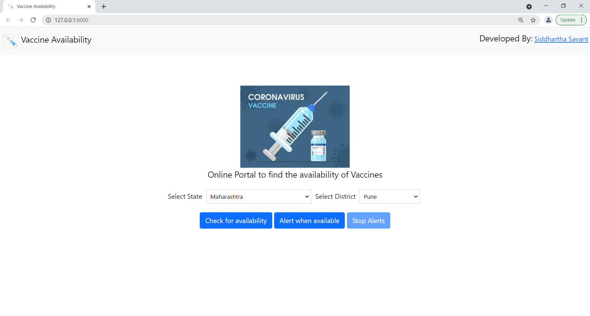

# Vaccine-Availability
Vaccine Availability - Django Project
* A Django Project to check for slot availability and set an alert for COVID-19 Vaccination centers in India using the CoWIN API.
* Select the state and the corresponding district from the dropdown after running the web application.
* Once "Check for Availability" button is pressed, centers along with their available dates, age limit, vaccine type and vacccine capacity will be displayed.
* The displayed data is for the next 7 days from today's date as per availability.
* "Alert when available" button when clicked, sets a scheduler which checks for vaccine availability at every 5 seconds for the selected state and district.
* It alerts the user with the address of the center, vaccine capacity, age limit and type of vaccine.
* Press "Stop Alerts" to stop the scheduler.

## Installation
Clone the repository and create a virtual environment to install dependencies.
Use the package manager [pip](https://pip.pypa.io/en/stable/) to install requirements.

```bash
pip install -r requirements.txt
```

Run the Django development server

```bash
python manage.py runserver
```
Visit `http://localhost:8000` to view the app.

Screenshot of the application:


